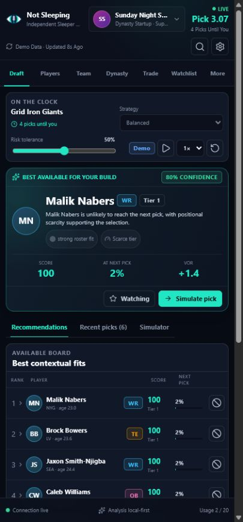

# Not Sleeping

[](https://github.com/jtaitt-dev/not-sleeping/actions/workflows/ci.yml)
[](https://github.com/jtaitt-dev/not-sleeping/actions/workflows/codeql.yml)
[](LICENSE)
[](.nvmrc)

An independent, open-source fantasy-football intelligence companion for
[Sleeper](https://sleeper.com/). Not Sleeping adds a responsive Chrome side
panel for live and mock drafts, exact legal lineup optimization, matchup and
Chopped survival distributions, waivers and FAAB, trades, rookies, dynasty,
taxi, IDP, auction planning, sourced research, and diagnostics.

Not Sleeping is not affiliated with, endorsed by, or sponsored by Sleeper or
OpenAI. It uses Sleeper's public read-only API and makes OpenAI features
optional through bring-your-own-key configuration.



## Why it is different

- Deterministic local rankings remain useful without an OpenAI key.
- Every recommendation exposes local score components, scarcity, roster fit,
  next-pick availability, and bounded research adjustment.
- Draft-mode and scoring detection use multiple league signals and show
  confidence instead of silently guessing.
- A capability-driven league context composes Dynasty, Best Ball, Chopped,
  Superflex, TE premium, IDP, taxi, auction, median, and waiver behavior from
  each league's actual settings. Unknown inputs stay visible and overridable.
- OpenAI research is explicit, citation-aware, rate limited, deduplicated, and
  sent through the Responses API with `store: false`.
- The API key defaults to session-only storage and never crosses a runtime
  message, log, diagnostic export, or content-script boundary.
- Sleeper access is read-only. The extension cannot draft, trade, edit a team,
  or authenticate as the user.

## Workspaces

The side panel includes Today, Leagues, Draft, Mock Draft Lab, Start & Sit or
Best Ball Optimizer, Matchup, Chopped Survival, Waivers, Trade, Dynasty,
Rookies, Taxi, IDP, Auction, Research, Players, Team, Watchlist, Compare,
Rankings, Data Center, Usage, Settings, Diagnostics, and About.
The popup reports current context and opens the panel. The options page handles
trusted account, key, model, privacy, theme, and operational settings.


## Full-season workspaces

All screenshots below are generated from the packaged MV3 extension against a
deterministic, API-shaped Sleeper fixture.

| League and weekly decisions                                      | Markets and roster planning                                |
| ---------------------------------------------------------------- | ---------------------------------------------------------- |
|          |            |
|            |            |
|  |          |
|            |          |
|                    |              |
|      |      |
|          |  |

## Install from source

Requirements:

- Chrome 116 or newer
- Node.js 22 LTS
- pnpm 11

```bash
git clone https://github.com/jtaitt-dev/not-sleeping.git
cd not-sleeping
corepack enable
pnpm install --frozen-lockfile
pnpm build
```

Then open `chrome://extensions`, enable **Developer mode**, choose
**Load unpacked**, and select the generated `dist` directory.

For development:

```bash
pnpm dev
```

WXT starts an isolated development profile and reloads the extension as source
changes.

## OpenAI setup

Open **Settings → OpenAI key**. Session-only storage is selected by default.
Remembered storage requires an explicit confirmation and is appropriate only
for a trusted browser profile. Use a dedicated project key with the minimum
permissions and budget needed.

Model IDs are loaded dynamically from the OpenAI Models API. The checked-in
defaults are `gpt-5.6-terra` for routine structured work and `gpt-5.6-sol` for
deeper current research, but users can select or manually enter a compatible
model. See [Models and OpenAI behavior](docs/MODELS.md).

Full setup and key-removal guidance is in
[OpenAI Setup](docs/OPENAI_SETUP.md). The key is optional: redraft, rookie,
startup, dynasty, trade, import, watchlist, and deterministic scoring
workflows remain available locally.

## Demo mode

The default first-run experience uses safe local data. Fifteen fixtures cover
redraft, dynasty startup, rookie, keeper, best ball, IDP, completed drafts,
traded picks, position runs, ambiguous identities, Sleeper outages, invalid
keys, quota exhaustion, rate limits, and offline use.

Demo controls can pause, advance, reset, and change speed. The decision
simulator never mutates the live draft board.

## Commands

| Command                            | Purpose                                                |
| ---------------------------------- | ------------------------------------------------------ |
| `pnpm dev`                         | Run the WXT development profile                        |
| `pnpm build`                       | Build MV3 output and prepare `dist/`                   |
| `pnpm zip`                         | Build a release ZIP and SHA-256 checksum               |
| `pnpm format:check`                | Verify Prettier formatting                             |
| `pnpm lint`                        | Run strict typed ESLint                                |
| `pnpm typecheck`                   | Run strict TypeScript                                  |
| `pnpm test`                        | Run unit, service, and provider tests                  |
| `pnpm test:coverage`               | Enforce 85/80/85/85 core thresholds                    |
| `pnpm test:e2e`                    | Load the built extension and run browser tests         |
| `pnpm test:visual`                 | Compare targeted visual baselines                      |
| `pnpm test:simulations`            | Run the deterministic simulation smoke matrix          |
| `pnpm test:simulations:exhaustive` | Run 5,000 overlapping draft and hybrid scenarios       |
| `pnpm test:backtest`               | Run walk-forward start/sit, draft, and waiver fixtures |
| `pnpm audit:prod`                  | Audit production dependencies                          |
| `pnpm validate:phase2`             | Run the complete Phase 2 release gate                  |

## Architecture and security

- [Architecture](ARCHITECTURE.md)
- [Data flow](docs/DATA_FLOW.md)
- [Threat model](docs/THREAT_MODEL.md)
- [Privacy](PRIVACY.md)
- [Security policy](SECURITY.md)
- [Security review](docs/SECURITY_REVIEW.md)
- [Installation and updates](docs/INSTALLATION.md)
- [OpenAI setup](docs/OPENAI_SETUP.md)
- [Data import](docs/DATA_IMPORT.md)
- [Valuation engine](docs/VALUATION_ENGINE.md)
- [Sleeper compatibility matrix](docs/SLEEPER_COMPATIBILITY_MATRIX.md)
- [Chopped Survival](docs/CHOPPED_SURVIVAL.md)
- [Model validation](docs/MODEL_VALIDATION.md)
- [UI design system](docs/UI_DESIGN_SYSTEM.md)
- [UI components](docs/UI_COMPONENT_INVENTORY.md)
- [UI workflows](docs/UI_WORKFLOWS.md)
- [Accessibility](docs/ACCESSIBILITY.md)
- [Testing](docs/TESTING.md)
- [Publishing](docs/PUBLISHING.md)
- [Troubleshooting](docs/TROUBLESHOOTING.md)

## Project status

The repository is production-oriented and packaged, but the extension has not
yet been submitted to the Chrome Web Store. Releases provide an unpacked
directory, ZIP archive, and checksum for reproducible manual installation.

Contributions are welcome. Read [CONTRIBUTING.md](CONTRIBUTING.md) and the
[Code of Conduct](CODE_OF_CONDUCT.md) before opening a pull request.
