# Not Sleeping

[](https://github.com/jtaitt-dev/not-sleeping/actions/workflows/ci.yml)
[](https://github.com/jtaitt-dev/not-sleeping/actions/workflows/codeql.yml)
[](LICENSE)
[](.nvmrc)
[](https://github.com/jtaitt-dev/not-sleeping/releases/latest)

An independent, open-source fantasy-football intelligence companion for
[Sleeper](https://sleeper.com/). Not Sleeping adds a responsive Chrome side
panel for live and mock drafts, exact legal lineup optimization, matchup and
Chopped survival distributions, waivers and FAAB, trades, rookies, dynasty,
taxi, IDP, auction planning, sourced research, and diagnostics.

Not Sleeping is not affiliated with, endorsed by, or sponsored by Sleeper,
OpenAI, or Anthropic. It uses Sleeper's public read-only API and makes AI
features optional through provider-isolated bring-your-own-key configuration.

One unified **Not Sleeping** artifact is produced. Advanced Research is part of
that extension but is hidden and locked by default. Enabling it requires an
explicit settings acknowledgement; its Manual Odds Research workspace then
requires separate 21+ and jurisdiction acknowledgements. It accepts only
user-supplied inputs and has no operator links, stake field, affiliate path, or
action capability.

Because the unified package contains manual-odds research, current releases are
limited-beta/sideload artifacts and are **not approved for Chrome Web Store
submission** without a fresh policy and legal review.

The current release is **[v0.8.1](https://github.com/jtaitt-dev/not-sleeping/releases/tag/v0.8.1)**.
It ships one unified Chrome MV3 archive with a matching SHA-256 checksum.


## New in v0.8.1

- Switching leagues immediately clears the previous draft and loads only the
  selected league's verified board; delayed refreshes, errors, and completed
  mocks from another league are rejected.
- When the open Sleeper tab is a live or mock draft for the selected league,
  that exact board takes priority over the league's separate scheduled draft.
- The unavailable/loading state no longer falls back to Big Bucks demo context,
  picks, or completion status.
- Current-account validation covers all four 2026 leagues and 1,224 legal,
  duplicate-free simulated picks without any Sleeper writes.
- The Windows reload helper supports current Chrome builds that expose Reload
  as a clickable accessibility control without `InvokePattern`.

## New in v0.8.0

- Draft is now one premium decision surface: Draft Context, Draft Copilot,
  Recommendation Board, Recent Picks, and What-If, without duplicate top-pick
  cards or manual secondary AI actions.
- Signed-in Sleeper navigation automatically resolves the account, leagues,
  active draft, real-versus-mock session, source league, settings, player pool,
  owned picks, traded picks, and current roster. Not Sleeping remains GET-only
  and never submits a pick, bid, nomination, or other Sleeper action.
- Local recommendations remain immediate when AI is off or unavailable. The
  in-card AI switch shows provider, model, effort, completed preparation work,
  working/ready state, and safe bounded errors without exposing provider or
  schema internals.
- Verified player headshots use a centralized resolver with lazy loading,
  preloading, failure memoization, and team/position/initial fallbacks.
- Scores preserve candidate separation instead of saturating at 100, while
  seeded next-pick simulations account for order, turns, traded ownership,
  tiers, ADP, opponent needs, and format-specific pools without claiming false
  precision.
- Rookie, auction, best-ball, IDP, Superflex/2QB, TE-premium, completed-draft,
  and consecutive-pick states now receive format-specific Draft Copilot logic.

| Big Bucks-style rookie mock                                        | Auction-specific Copilot                                             |
| ------------------------------------------------------------------ | -------------------------------------------------------------------- |
| 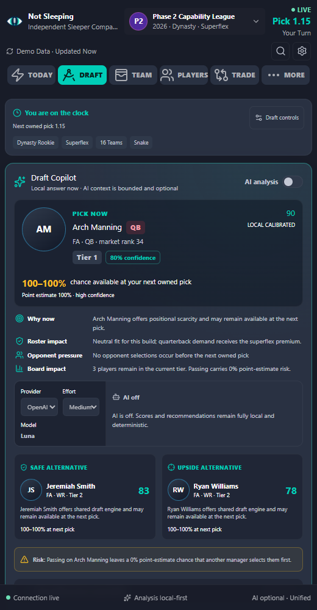 | 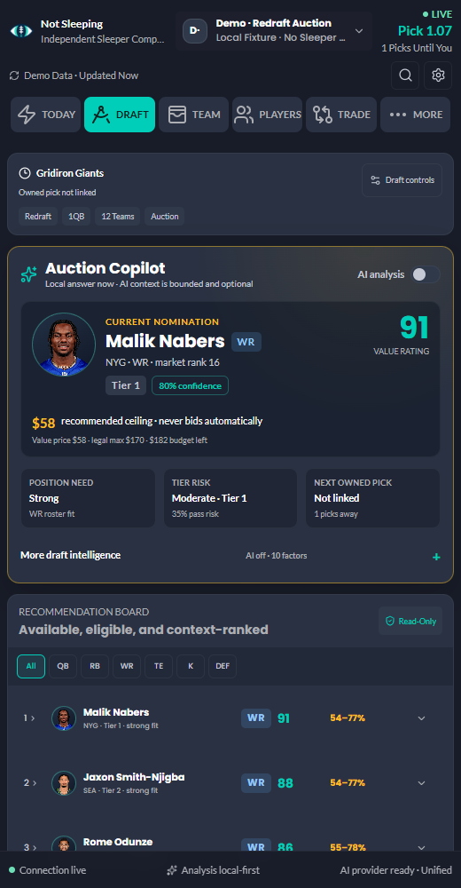 |
| 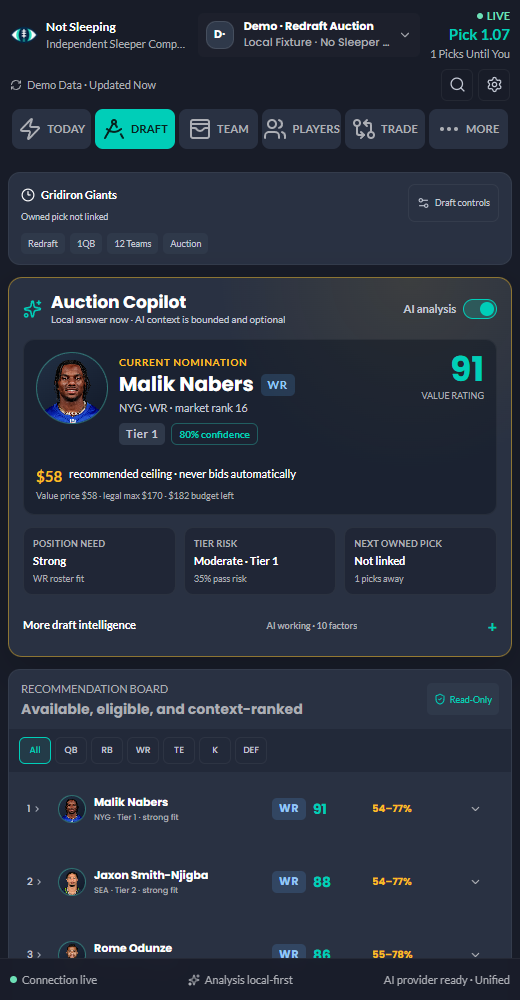       | 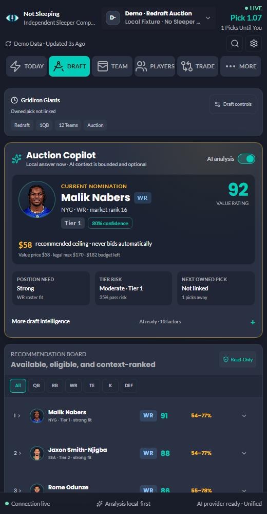             |

The narrow-panel acceptance capture is
[320px Draft Copilot](docs/screenshots/draft-premium-320.png); the wider state
is [600px Draft Copilot](docs/screenshots/draft-premium-600.png).

## New in v0.7.1

- A signed-in Sleeper page now securely supplies the visible navigation-profile
  username to the extension, which resolves the stable account ID and loads
  every available league season automatically.
- Account discovery is read-only, origin-restricted, credential-free, bounded,
  and keeps manual username entry as a fallback.
- The account-scoped league database migration now uses a valid two-step
  IndexedDB upgrade, preserving unrelated local data while rebuilding public
  league catalogs safely.
- The Windows reload helper targets the matching Not Sleeping extension card,
  so development reloads no longer risk refreshing a different unpacked
  extension.

## New in v0.7.0

- League mocks derive their format, order, scoring, roster slots, player pool,
  and traded-pick ownership from verified Sleeper settings.
- Manual entry is the default. Every pick is checked for exact order,
  ownership, eligibility, pool limits, and duplicates without writing anything
  to Sleeper.
- Mock drafts autosave by account, league, and draft, with pause, undo, redo,
  reset, and deterministic non-AI recommendations.
- Optional Luna analysis remains bounded; legality and local rankings stay
  authoritative when AI is unavailable or disabled.

<p align="center">
  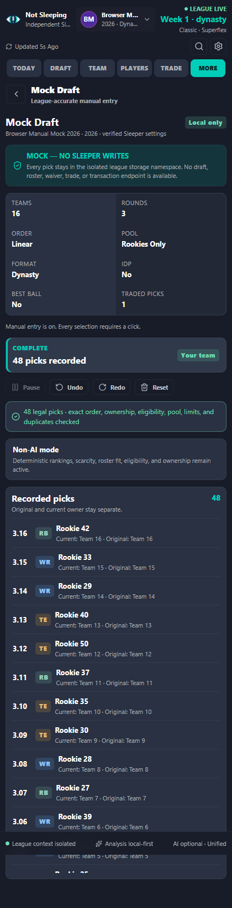
</p>

## Why it is different

- Deterministic local decisions remain immediate without any AI key.
- Every recommendation exposes local score components, scarcity, roster fit,
  next-pick availability, and bounded research adjustment.
- Draft-mode and scoring detection use multiple league signals and show
  confidence instead of silently guessing.
- A capability-driven league context composes Dynasty, Best Ball, Chopped,
  Superflex, TE premium, IDP, taxi, auction, median, and waiver behavior from
  each league's actual settings. Unknown inputs stay visible and overridable.
- OpenAI and Anthropic implement one provider-neutral interface with dynamic
  models, capability-aware effort/thinking controls, strict structured output,
  bounded analysis, retries, timeouts, and optional consensus.
- Each provider key defaults to session-only storage and never crosses a runtime
  message, log, diagnostic export, or content-script boundary.
- Sleeper access is read-only. The extension cannot draft, trade, edit a team,
  or authenticate as the user.
- League mocks inherit verified Sleeper settings and traded-pick ownership,
  default to manual entry for every pick, validate legality after each entry,
  and recover locally by account, league, and draft.
- OpenAI Luna is the new-user routine-analysis default; a valid existing model
  preference is preserved while invalid or removed choices fail safely to Luna.

## Workspaces

The side panel includes Today, Leagues, Draft, Mock Draft, Start & Sit or
Best Ball Optimizer, Matchup, Chopped Survival, Waivers, Trade, Dynasty,
Rookies, Taxi, IDP, Auction, Research, Players, Team, Watchlist, Compare,
Rankings, Data Center, Usage, Settings, Diagnostics, and About. Advanced
Research appears only after its settings gate is acknowledged and enabled.
The popup reports current context and opens the panel. The options page handles
trusted account, key, model, privacy, theme, and operational settings.

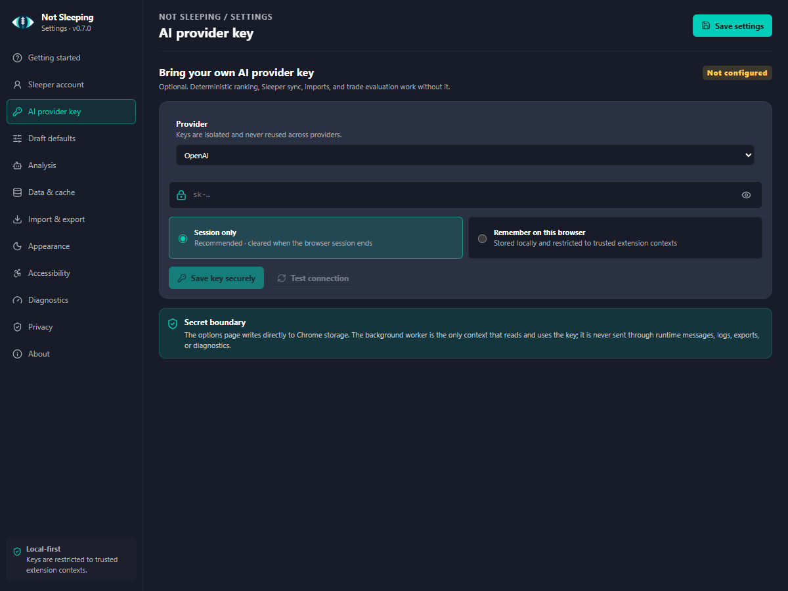

## Full-season workspaces

All screenshots below are generated from the packaged MV3 extension against a
deterministic, API-shaped Sleeper fixture.

| League and weekly decisions                                      | Markets and roster planning                                |
| ---------------------------------------------------------------- | ---------------------------------------------------------- |
| 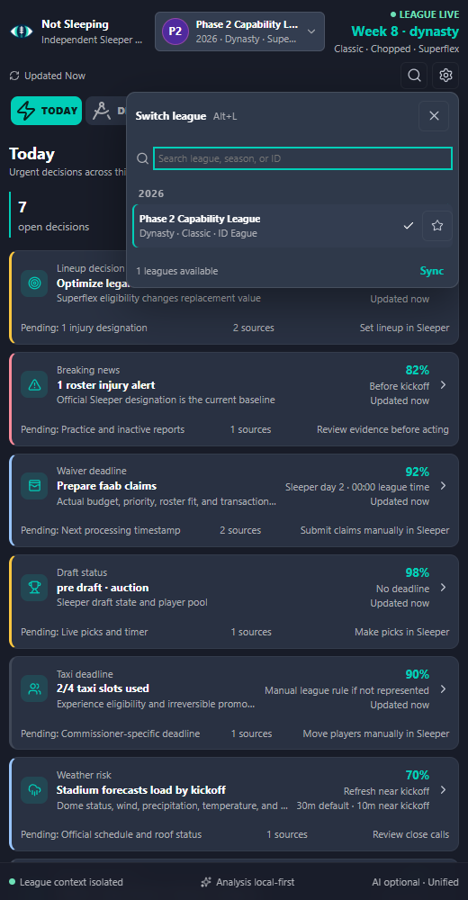         | 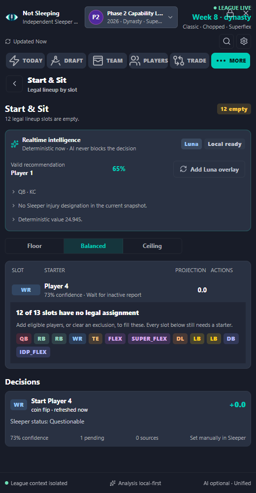           |
| 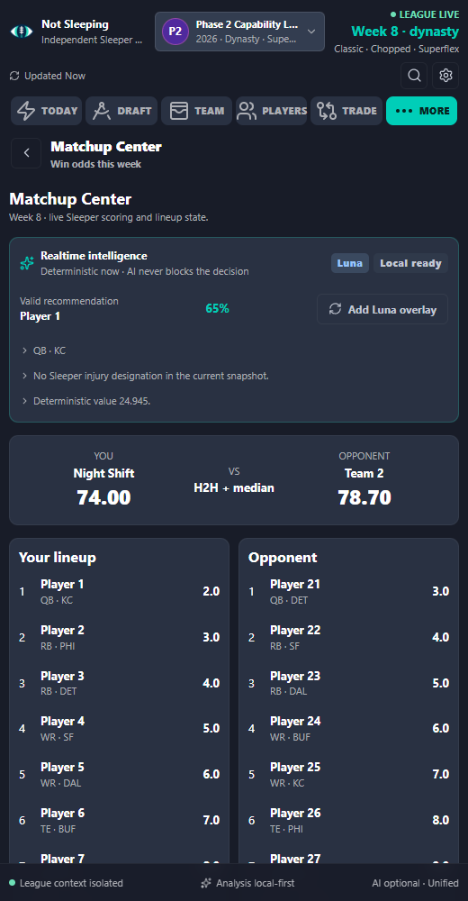           | 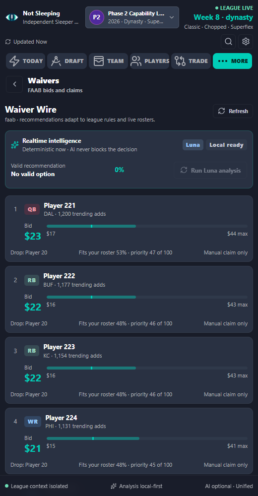           |
| 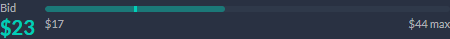 | 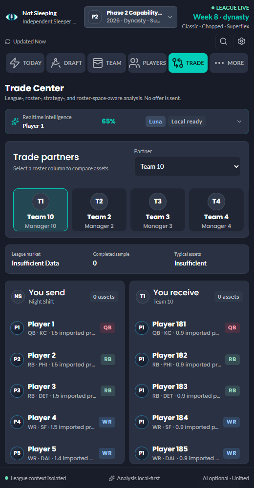         |
| 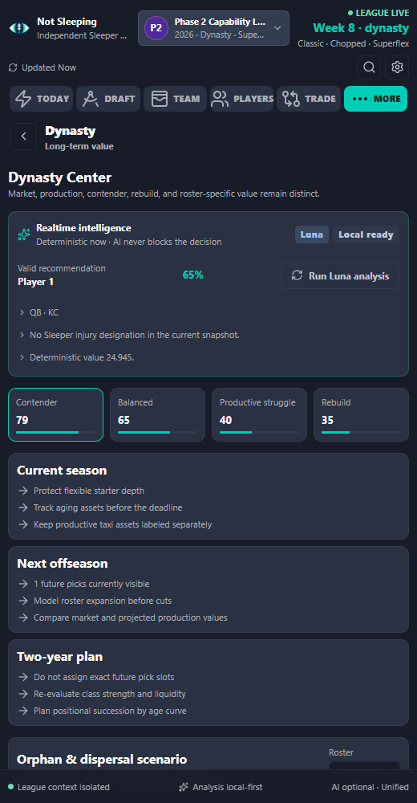           | 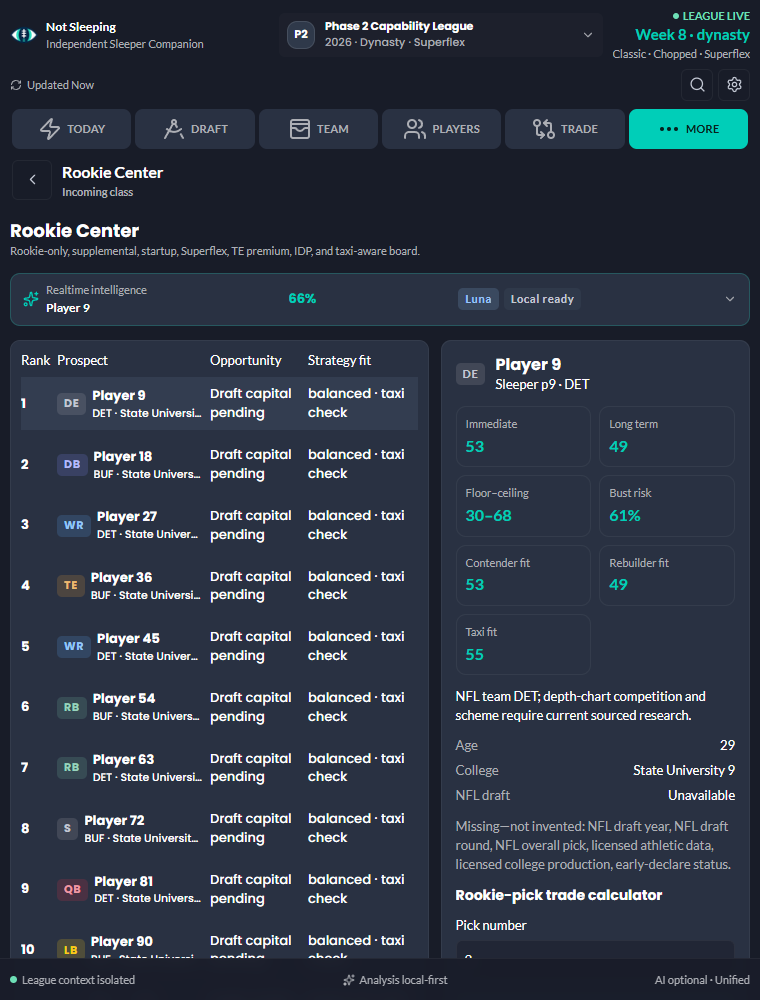         |
| 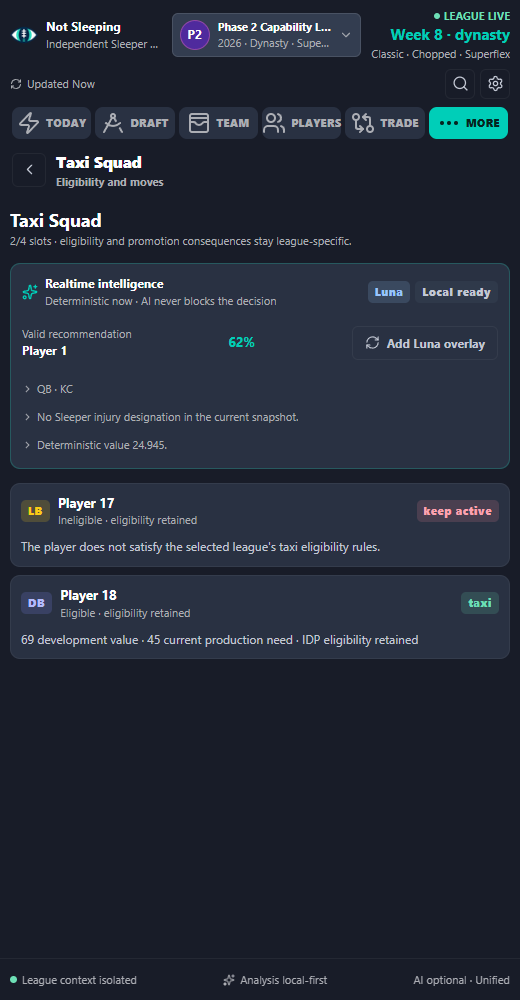                   | 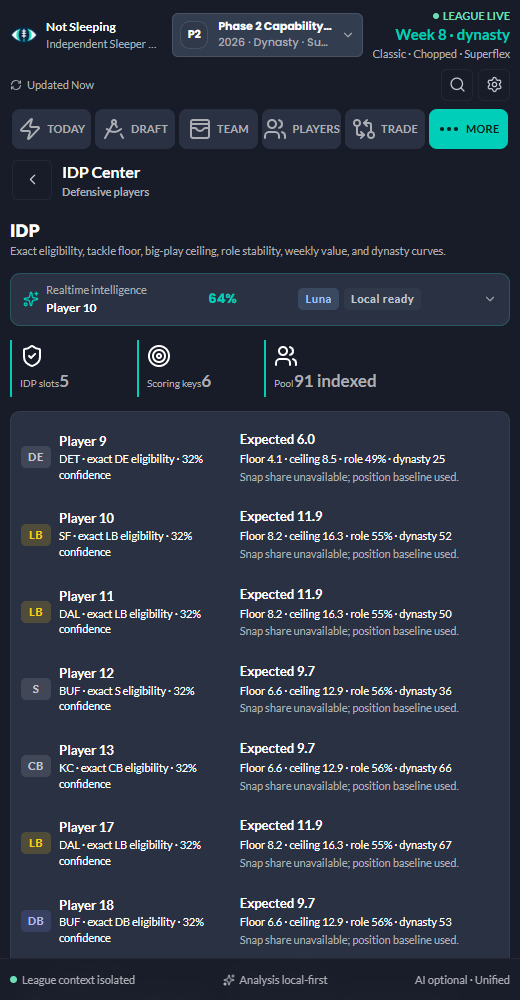             |
| 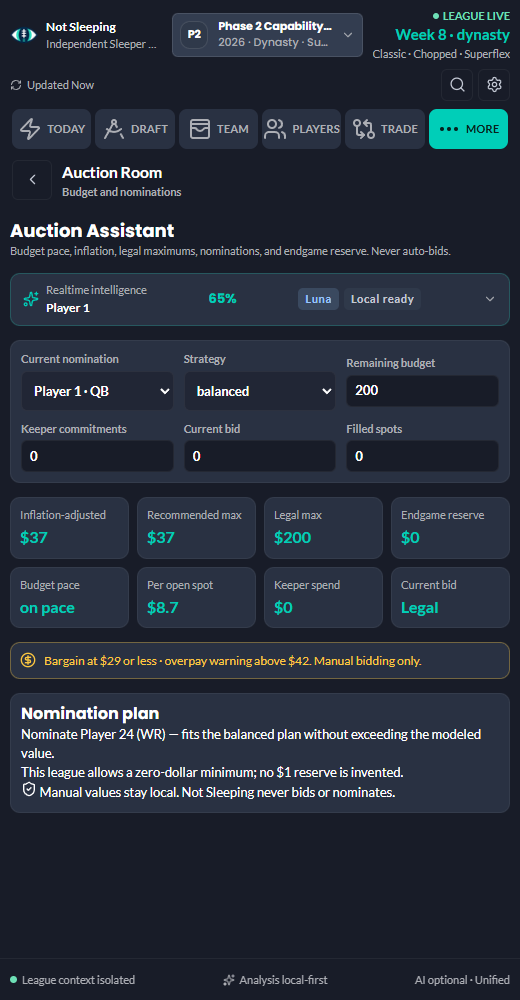     | 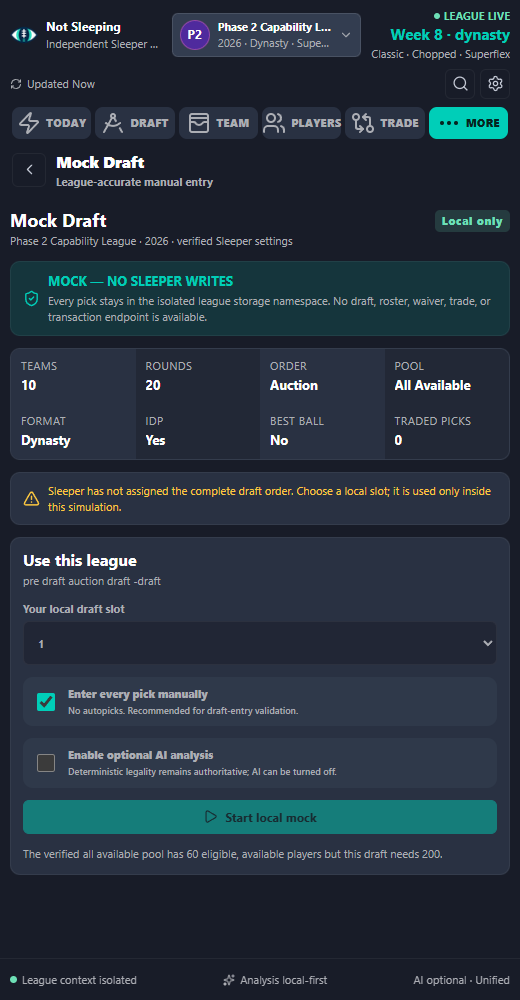         |
| 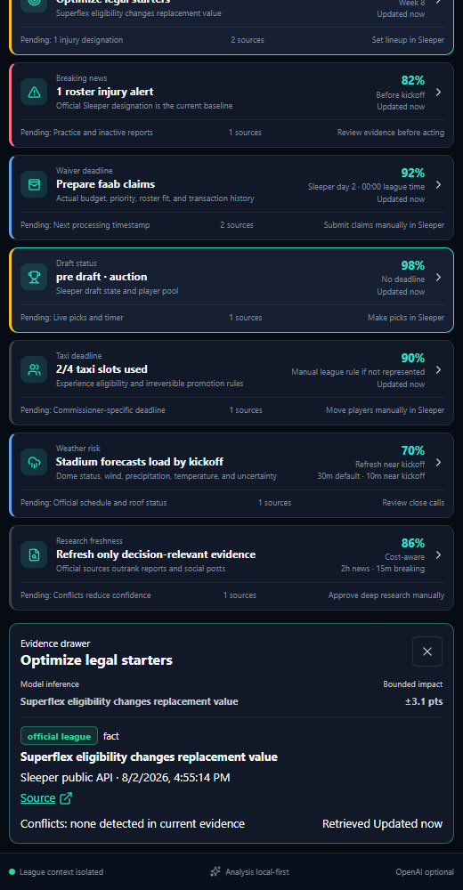         | 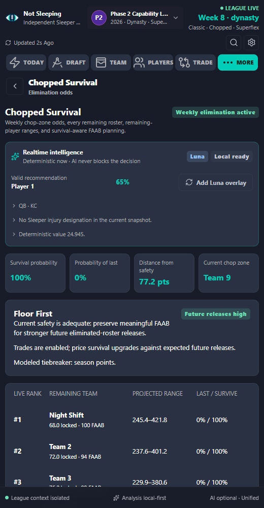 |

## Install from source

Requirements:

- Chrome 116 or newer
- Node.js 22 LTS
- pnpm 11

```bash
git clone https://github.com/jtaitt-dev/not-sleeping.git
cd not-sleeping
corepack enable
pnpm install --frozen-lockfile
pnpm build
```

Then open `chrome://extensions`, enable **Developer mode**, choose
**Load unpacked**, and select `dist`. There is no second flavor or package.

For development:

```bash
pnpm dev
```

WXT starts an isolated development profile and reloads the extension as source
changes.

## Multi-provider setup

Open **Settings → AI providers** and choose OpenAI or Anthropic. Session-only
storage is selected by default for each isolated credential.
Remembered storage requires an explicit confirmation and is appropriate only
for a trusted browser profile. Use a dedicated project key with the minimum
permissions and budget needed.

Model IDs are loaded dynamically from the selected provider. Global presets and
per-feature overrides control provider, model, routing, reasoning effort,
Anthropic thinking mode, web search, token budget, and timeout. Unsupported
controls are omitted and surfaced rather than guessed.

Full setup and key-removal guidance is in
[Multi-provider setup](docs/MULTI_PROVIDER_SETUP.md),
[OpenAI setup](docs/OPENAI_SETUP.md), and
[Anthropic setup](docs/ANTHROPIC_SETUP.md). Keys are optional: redraft, rookie,
startup, dynasty, trade, import, watchlist, and deterministic scoring
workflows remain available locally.

## Demo mode

The default first-run experience uses safe local data. Seventeen fixtures cover
Big Bucks-style league mocks, redraft, dynasty startup, rookie, keeper, best
ball, auction, IDP, completed drafts, traded picks, position runs, ambiguous
identities, Sleeper outages, invalid keys, quota exhaustion, rate limits, and
offline use.

Demo controls can pause, advance, reset, and change speed. The decision
simulator never mutates the live draft board.

## Commands

| Command                            | Purpose                                                |
| ---------------------------------- | ------------------------------------------------------ |
| `pnpm dev`                         | Run the WXT development profile                        |
| `pnpm build`                       | Build the unified MV3 extension in `dist`              |
| `pnpm zip`                         | Build one release ZIP and SHA-256 checksum             |
| `pnpm assert:unified-bundle`       | Verify one build contains the gated research workspace |
| `pnpm format:check`                | Verify Prettier formatting                             |
| `pnpm lint`                        | Run strict typed ESLint                                |
| `pnpm typecheck`                   | Run strict TypeScript                                  |
| `pnpm test`                        | Run unit, service, and provider tests                  |
| `pnpm test:coverage`               | Enforce whole-logic 76/64/76/78 thresholds             |
| `pnpm test:e2e`                    | Load the built extension and run browser tests         |
| `pnpm test:visual`                 | Compare targeted visual baselines                      |
| `pnpm test:ai-evals`               | Run sanitized, credential-free AI decision evals       |
| `pnpm test:simulations`            | Run the deterministic simulation smoke matrix          |
| `pnpm test:simulations:exhaustive` | Run 5,000 overlapping draft and hybrid scenarios       |
| `pnpm test:backtest`               | Run walk-forward start/sit, draft, and waiver fixtures |
| `pnpm audit:prod`                  | Audit production dependencies                          |
| `pnpm validate:phase2`             | Run the complete Phase 2 release gate                  |
| `pnpm validate:phase3`             | Run the complete unified-product and AI release gate   |

## Architecture and security

- [Architecture](ARCHITECTURE.md)
- [Data flow](docs/DATA_FLOW.md)
- [Threat model](docs/THREAT_MODEL.md)
- [Privacy](PRIVACY.md)
- [Security policy](SECURITY.md)
- [Security review](docs/SECURITY_REVIEW.md)
- [Draft Copilot](docs/DRAFT_COPILOT.md)
- [Final validation report](docs/VALIDATION_REPORT_2026-08-10.md)
- [Installation and updates](docs/INSTALLATION.md)
- [OpenAI setup](docs/OPENAI_SETUP.md)
- [Anthropic and multi-provider setup](docs/MULTI_PROVIDER_SETUP.md)
- [AI architecture](docs/AI_ARCHITECTURE.md)
- [Realtime decision engine](docs/REALTIME_DECISION_ENGINE.md)
- [Sleeper news and metadata limits](docs/SLEEPER_NEWS.md)
- [Manual odds research](docs/MANUAL_ODDS_RESEARCH.md)
- [Advanced research risk and distribution](docs/ADVANCED_RESEARCH_RISK.md)
- [Data import](docs/DATA_IMPORT.md)
- [Valuation engine](docs/VALUATION_ENGINE.md)
- [Sleeper compatibility matrix](docs/SLEEPER_COMPATIBILITY_MATRIX.md)
- [Chopped Survival](docs/CHOPPED_SURVIVAL.md)
- [Model validation](docs/MODEL_VALIDATION.md)
- [UI design system](docs/UI_DESIGN_SYSTEM.md)
- [UI components](docs/UI_COMPONENT_INVENTORY.md)
- [UI workflows](docs/UI_WORKFLOWS.md)
- [Accessibility](docs/ACCESSIBILITY.md)
- [Testing](docs/TESTING.md)
- [Publishing](docs/PUBLISHING.md)
- [Troubleshooting](docs/TROUBLESHOOTING.md)

## Project status

The repository is production-oriented and packaged, but the extension has not
yet been submitted to the Chrome Web Store. Releases provide an unpacked
directory, ZIP archive, and checksum for reproducible manual installation.

Contributions are welcome. Read [CONTRIBUTING.md](CONTRIBUTING.md) and the
[Code of Conduct](CODE_OF_CONDUCT.md) before opening a pull request.
